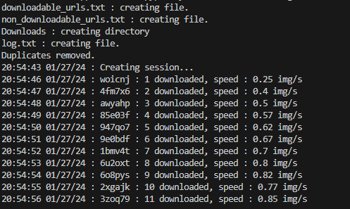

# LightShot-screenshots-downloader

LightShot is a website that lets users take screenshots and upload them to their platform to make it easier to share them. The links have this structure: `https://prnt.sc/[6 characters of letters and numbers]`.

**LightShot-Screenshots-Downloader** is a Python program that retrieves screenshots that LightShot users have taken.



## How to Use

To use the program, follow these steps:

1. **Install Dependencies**:
   
   Make sure you have Python installed on your system. Then, use Poetry to install the required libraries. If you don't have Poetry installed, you can install it following the official documentation: [Poetry Installation](https://python-poetry.org/docs/#installation).

   Open your terminal and navigate to the project directory. Run the following command to install the dependencies:

   ```bash
   poetry install

2. **Run the Program**:

    After installing the dependencies, you can run the main.py script. Use the following command:

    ```bash
    poetry run python main.py

The program will execute and perform the following steps:

Generate a random combination of characters.
Check if the link actually exists.
If the link exists, it will be written to the existinglist.txt file.
If the link does not exist, it will be written to the nonexistinglist.txt file.
This process helps avoid using already generated combinations. When the screenshot exists, it will be downloaded into a specific folder.

Feel free to customize the program or folder settings as needed for your use case.

Note: Ensure that you have internet access while running the program, as it relies on online resources to check the existence of the links and download the screenshots.